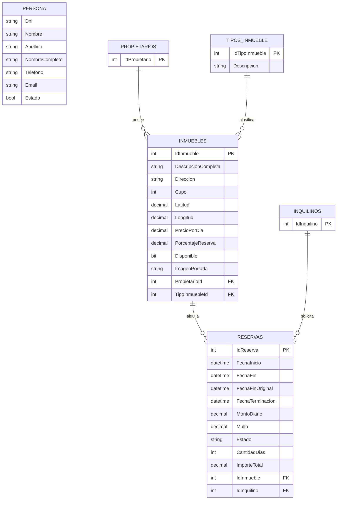

# Sistema de Gestión Inmobiliaria - Reservas Temporales

> Aplicación web desarrollada en ASP.NET Core MVC para la informatización y control de alquileres temporarios, inmuebles, propietarios, inquilinos y cobros de la agencia inmobiliaria.

---

## 👥 Integrantes del Grupo

* **Nombre y Apellido** - *ezamora@ulp.edu.ar* - [@Eros23z](https://github.com/Eros23z) - Discord: `abyss23z`

---

## 📐 Modelado de Datos

A continuación se presenta el esquema relacional del modelo de datos de la aplicación:

### Diagrama Entidad-Relación (DER)

Ver diagrama en código Mermaid

---

## 🚀 Instrucciones para Levantar la Base de Datos

1. Abrir **SQL Server Management Studio (SSMS)** o la ventana de **SQL Server Object Explorer** en Visual Studio.
2. Conectarse a la instancia local (`(localdb)\mssqllocaldb` o `localhost`).
3. Abrir el archivo `database.sql` ubicado en la raíz del proyecto.
4. Ejecutar el script completo (`F5` o botón **Execute**).
5. Verificar que se hayan creado la base de datos `InmobiliariaDB` y las tablas con sus datos iniciales.
6. Ajustar la cadena de conexión en el archivo `appsettings.json` si su instancia local utiliza credenciales distintas.